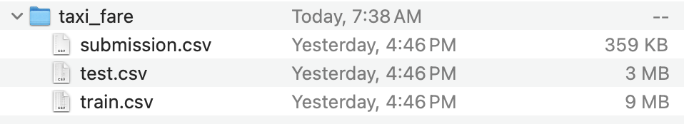
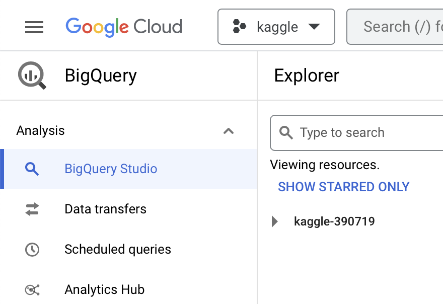

# Set up and use SQL in the cloud
Most people have limits on the computational capacity they have access to.
Here I'll describe steps to set up a SQL database on the cloud where, instead of paying for a brand new computer, one can pay only for what they use.

In the following example, I will be using a small Kaggle dataset to outline the steps which one would take to populate a SQL database and do analysis in the cloud.

## Download a Kaggle dataset.
Grab the following files from 
[Taxi Trip Fare Prediction](https://www.kaggle.com/datasets/nani123456789/taxi-trip-fare-prediction) on Kaggle (you'll need an account for this):

## Create and enable BigQuery on Google Cloud.
Make sure you have BigQuery enabled on your Google Cloud project.
You'll need to set up a Google Cloud account (see [Getting Started](https://cloud.google.com/docs/get-started)) and [create a project](https://developers.google.com/workspace/guides/create-project).
You should see the screen below when you visit `https://console.cloud.google.com/bigquery?project=<your-project-name>`:

Otherwise, you should see a splash screen to enable BigQuery. Follow the instructions to do so.

Remaining chapters
* Ingest dataset into bigquery with python.
* Doing analysis on the dataset with python. 
