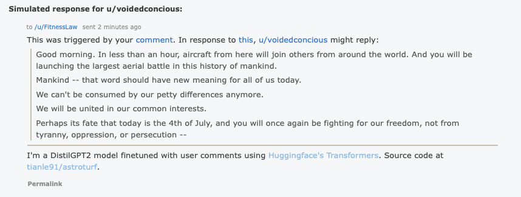

# Past time projects

## [tianle91/image-deduplication](https://github.com/tianle91/image-deduplication)
Use perceptual hashing to deduplicate images!

## [tianle91/SpaceTimePandas](https://github.com/tianle91/SpaceTimePandas)
More location and date time features than you'll ever practically need.

## [tianle91/astroturf](https://github.com/tianle91/astroturf)
Simulate responses of a real redditor.

