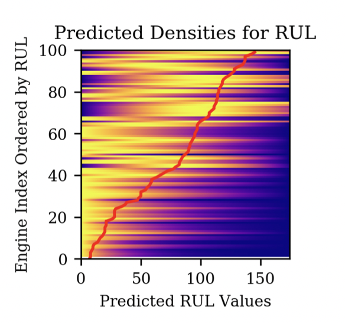
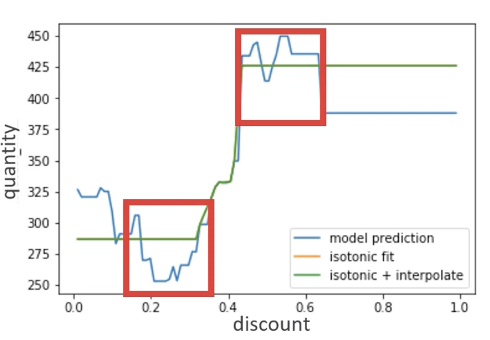

# Publications

## Product Matching Lessons and Recommendations from a Real World Application
Foxcroft J., Antonie L., **Chen T.**, Padmanabhan K. and Keng B. (2021).
Published in Proceedings of Canadian AI 2021.
[CAIAC](https://caiac.pubpub.org/pub/klikfzaf/)

## Multivariate Arrival Times with Recurrent Neural Networks for Personalized Demand Forecasting
**Chen, T.**, Keng, B., Moreno, J. (2018)
Published in Proceedings of IEEE International Conference on Data Mining 2018 DMS Workshop.
[tianle91/matrnn](https://github.com/tianle91/matrnn)
[arxiv](http://arxiv.org/abs/1812.11444)

## A Marked Cox model for the Number of IBNR Claims: Estimation and Application
Badescu, A.L., **Chen, T.**, Lin, X.S., & Tang, D. (2019)
ASTIN Bulletin 2019.
[SSRN](https://papers.ssrn.com/sol3/papers.cfm?abstract_id=2747223)

# Talks

## All You Need is Consistent Promotions

Kanchana P., <b>Chen T.</b> (2021).
[YouTube (CORS 2021)](https://www.youtube.com/watch?v=q7gsFr0SZok)
- Toronto Machine Learning Society - ML In Retail (2021-04-21).
- POMS 2021 - Global Supply Chain Management track (2021-05-04).
- Canadian AI 2021 - Industry Track (2021-05-25).
- CORS 2021

