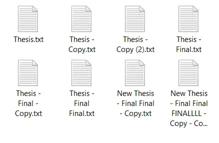
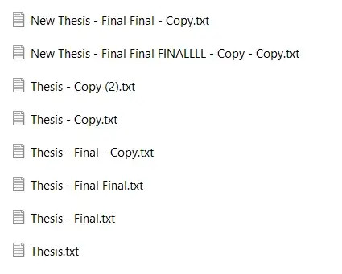
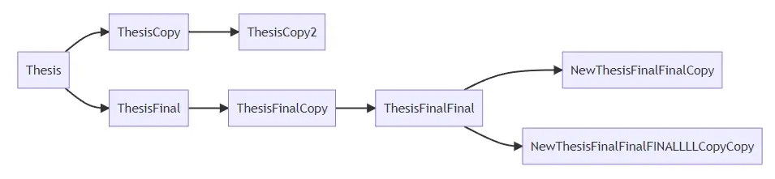
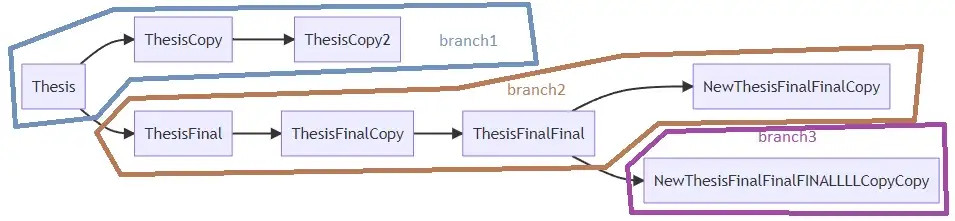
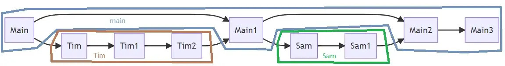
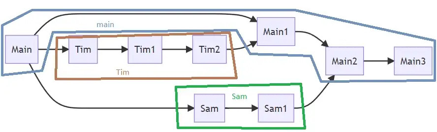

<!-- Google tag (gtag.js) -->

# New Final Final (2) Copy: Ideas in Version Control
There comes a time in every project when one has to come to terms with the mess that they have made. The number of files are sprawling and each of them claims to be the most recent version and somehow none of them has exactly what you need. What exactly happened here?

You ask a software developer and turns out you need this thing called “Version Control”. Right before your friend started saying “Git”, you muted the chat — the best course of action IMO. However, the idea seems useful. There are so many versions and it would certainly make sense to control them... whatever that means.

## What’s Version Control anyway?
We want to track changes in a document or project in a sequential way. One way of creating a sequence can be achieved by sorting the files by “Date Modified”, which reveals that the top-most file is the most recently modified one.

However, projects can get complicated and changes do not necessarily stack on top of each other cleanly. Perhaps the most recently modified file was a change that didn’t work out! We do not want to use that file.

A flow chart would show a much better sequence of versions — not only the changes but also the reverting of changes (i.e. undo). You can also see that some versions branched off from others, resulting in two children versions on which further changes have been made. Now you’re better able to pick and choose the state of the file (or project) you want to continue working on and use.

> A Version Control system tracks changes in the state of a project in a sequential manner, including any reverts and branching.

## Branches

The sequences of changes above are typically organized into “branches” for convenience. A branch is a sequence of states wherein each state in a branch can only be followed by another state in the same branch. One can create a new branch from any state on another branch.

## Automation

In a document processor such as Microsoft Word or Google Docs, there are automatic checks any time you make a change to the document such as spelling and grammar checks. This means that for any version of the file, you’d automatically know whether the spelling and grammar checks passed.

In general, you can set up a Version Control system with processes to automatically run after every change in the state of your project. Examples include automatically sending an email to your editor to check your document and get their approval, sending an order to 3D print your design or sending a HIGH PRIORITY email to all of your factories to reorganize all production lines according to the new design.

There are generally two types of automated processes:
- Integration — making sure that any changes are “good” (e.g. spell checks, editor reviews)
- Deployment — propagating the project changes to anywhere that needs it (e.g. reorganizing production lines, sending a new book to print).

The automated part makes it “continuous”, giving you what’s commonly known as Continuous Integration and Continuous Deployment (CICD).

However, not all CICD are equal — some are much more expensive and risky than others. This brings us to the next idea in Version Control: The Canonical Branch.

## The Canonical Branch

In this model of collaboration, everyone refers to a single branch of the project. This is commonly known as `main`, `master`, etc. 

When making a change to the project, one branches off from the most recent state of the project and make changes *on their own branch*. After their work is done, they *reconcile the changes* made on their branch and the changes that have been made to the main branch (if any). In the example, there aren’t any changes to the main branch when Tim and Sam were working on the project.

This assumption makes it possible to collaborate with other members of a project. This includes users which may make a change or improvement to the project as well as upstream and downstream users which feed into or depend on the project. Thus, changes to The Canonical Branch need to be validated to prevent unexpected changes such as a broken or poorly performing project.

Book editions are examples of *The Canonical Branch*. Publishers, readers as well as the Authors of the books organize themselves by referring to a particular edition of a book. While authors may make changes from one edition of the book to the other, these generally don’t matter to other users of the book until they make it into a new edition. Publishers print and market certain editions of the book. Teachers and readers referred to book editions when communicating about which version of the book to use.

## CICD
Since *The Canonical Branch* is the single reference for all users and developers of the project, it makes sense for many developers to automatically Deploy changes (i.e. propagating changes to all users of the project) from *The Canonical Branch* once a series of Integration checks (i.e. checks that the changes are “good”) have passed. Depending on the project, the Deploy step can get arbitrarily complex — ranging from doing nothing, uploading a compiled/exported version of the project to slowly switching over some live services to the new version while monitoring for any uncaught errors.

There can be Integration checks set up to run on any development branches as well, to ensure that the person working on new changes is aware of any breaking changes. Deploy steps are often not included by default in development branches due to the amount of changes and the high likelihood that something is broken while changes are taking place.

## Concurrent changes
In the process of working on the project, users might make concurrent changes. This is often a pain point in collaboration due to potential incompatibilities of the changes they might introduce.

In the following example, you see that both Tim and Sam started working on the project at “Main” but Tim added his changes to “Main” first, causing the branch to progress to “Main1”. At this time, Sam decides to add his changes to the main branch. There can potentially be changes made by Sam which are not compatible with the changes made by Tim. 

Generally there are two types of incompatibilities.
- Conflicting changes: both Tim and Sam’s branches include changes to the same portion of the project. Now we don’t know which one to use or neither. Sam will need to include Tim’s changes in his branch before attempting to add his changes to the main branch.
- Non-additive changes: changing isolated portions of the project doesn’t ensure that the functionality remains independent. Even if both Tim and Sam’s changes are known to be good, there’s no guarantee that the project (i.e. the main branch) remains good after including Sam’s changes. We’ll need to include the changes on the main branch in Sam’s branch first and run checks prior to including Sam’s changes.

## What now?
Now you’re ready to learn about Git! Why not start with the company making sooo much money off it? [Github Quickstart](https://docs.github.com/en/get-started/quickstart/hello-world) is a good place to start.
