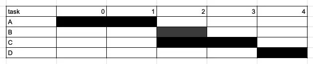
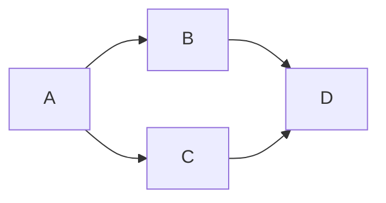

# Why can’t I just cron my batch pipeline?

> So many batch pipeline orchestrators, which one to use? (hint: not cron)

Say you’ve created an application to extract value out of data, now you need to rerun a series of steps periodically to generate new data for your application, taking new data as input each time it was rerun. Figuratively, you want to create a pipe, though which new data can flow, a pipeline, if you will.

## Just run it on a schedule!
`crontab` is a commonly used tool for many people. What it does is simple — just run a command (i.e. a job or task) on a given schedule! 

For example `5 4 * * *` indicates that a particular command be run whenever the clock hits 4:05 (i.e. daily). See [crontab.guru](https://crontab.guru) or just type `man crontab` on your terminal to get started. This simple approach brings about two major issues.

### Retrying failures
Jobs can fail for any number of reasons, such as a command running on a spot instance being killed by a cloud provider while running or expired credentials.

Recovering from intermittent errors is easy — a simple retry will do. Ensuring that a retry succeeds requires that jobs are idempotent (i.e. each run returns exactly the same results). This is not usually verified but assumed, so that jobs can be skipped in case of a retry. In luigi, this is achieved by setting up a task output property.

### Dependencies
In many cases, some jobs depend on prior jobs succeeding. One way to solve this issue with crontab is simply to observe past runtimes and schedule downstream jobs after their upstream jobs are completed.

Basically it's just a gantt chart, where downstream tasks start and we cross out fingers and hope everything upstream has already completed.

The downsides of this approach is that it can be an involved process to benchmark past runtimes and set appropriate schedules. However, a schedule that works for most of the historical runtimes can also be too loose and take a much longer time than expected. On the other hand, a tight schedule is prone to changes caused by jobs taking longer than anticipated.

A common way to manage dependencies is to explicitly specify dependencies is to use relationships such as requires (i.e. defining upstream dependencies in [`luigi`](https://luigi.readthedocs.io/en/stable/api/luigi.task.html#luigi.task.Task.requires)), set_upstream, set_downstream (in [Apache Airflow](https://airflow.apache.org/docs/apache-airflow/stable/tutorial/fundamentals.html#setting-up-dependencies)). 

Just specifying these relationships doesn’t mean that the jobs are set up in a way that can actually be run, since there may be cyclical dependencies. If one plots out the dependencies between jobs, with jobs forming nodes and their upstream requirements as the edges, they should form a DAG (i.e. a directed acyclic graph) — meaning that there should be no cycles (i.e. jobs eventually requiring itself). 

This DAG represents the same dependencies as the gantt chart above.

[This example](https://leetcode.com/problems/course-schedule/) on leetcode solves this problem.

## Monitoring
There are a few main areas of monitoring (i.e. group-managed emails or notifications on an internal messaging platform such as Slack or Teams) that are common:
- Job statuses: job failures, jobs being retried, jobs taking longer than expected, jobs not starting by a specified time.
- Job inputs: validation checks failing on job inputs or upstreams.
- Job outputs: validation checks failing on job outputs.
- Dependency checks: number of jobs created exceeds tolerance or validation checks failing on job parameters.

## What to look out for
To summarize, here’s a few things to look out for (on top of running through the documentation):
- Time-based scheduling: Batch jobs typically need to happen at a set frequency — a standard way of specifying this such as cron is essential.
- Idempotent jobs: Jobs can fail and when they do, we want to know that they’ll give the same outputs each time they’re rerun.
- DAG checking: Typically your orchestrator of choice checks for non-circular dependencies and you wouldn’t need to worry about it too much if your jobs make logical sense.
- Monitoring solutions: What are the failure modes you want to identify and how will you want to be notified?
