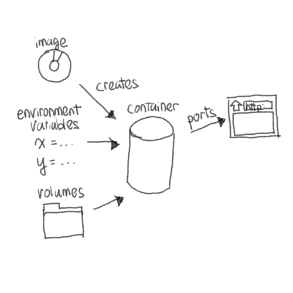

<!-- Google tag (gtag.js) -->

# Docker for linux casuals
Many moons ago I recall installing Ubuntu on my home PC because I was sick of Windows, the only operating system I had used up to that point. Even though Ubuntu was (and still is) a mainsteam flavour of Linux, I found that it was pretty rare that an application I need got installed with zero issues. So I promptly formatted my hard drive and reinstalled Windows and it wasn't until MacOS that a Unix-based operating system became my daily driver.

However, a lot of things have happened since then. But mainly, these two trends have significantly simplified application development.
1. Every interface is now browser-based.
2. Every application is docker.

Now, deploying an application on any linux environment is easy so long as there's docker installed. That means you can run the same thing on a Windows desktop (via WSL), a MacOS laptop, an AWS server, a Synology NAS or even a Raspberry Pi.

## What is Docker? 
Docker is a way to run applications in an isolated environment (like a virtual machine) without the overhead of a VM.
This is possible because the host machine (where docker is installed) uses resource isolation tricks to create spaces for applications to run (aka container).
Gone are the days when linux users have to deal with endless application setup tweaks to make things work on your specific flavour of linux. 

## Using a single container
You can create a container using `docker run IMAGE` or `docker-compose up` with a configured `docker-compose.yaml` in your working directory.
For the full specification, see the official documentation [docker run](https://docs.docker.com/engine/reference/commandline/run/) for the former and [compose-file-v3](https://docs.docker.com/compose/compose-file/compose-file-v3/) for the latter.

Here's basically everything you need to know about creating a container.

| terminology | `docker run ...` | `docker-compose.yaml` | description |
| ---- | ---- | ---- | ---- | 
| image | `docker run IMAGE` | `image: ...` | A base environment for your application. Many applications have pre-made docker images such as `ubuntu`, `linuxserver/sonarr`. Chances are if the application supports linux, then a docker image exists for that application. | 
| ports | `docker run --expose` | `ports: ...` | Makes a port available to be reached on the host so that you can interact with the application through `localhost:port_number`. Typically used for interfaces. | 
| volumes | `docker run --volume` | `volumes: ...` | Makes a path on the host available to the application so that reads and writes are reflected on the host. Can be used to persist application states through container recreation. |
| environment variables | `docker run --env` | `environment: ...` | Sets environment variables required by the application. |

## Multiple containers
Some applications require multiple containers to interact with each other.
Docker is an easy way to set up isolated environments for them to do so.

For an example, see [xarr-stack](https://github.com/tianle91/xarr-stack/blob/main/docker-compose.yaml).
- `gluetun` is a VPN service that routes traffic through a VPN server.
- `qbittorrent` is a torrent client that uses `gluetun` for its network, so that all torrent traffic flows through the VPN server.
- `prowlarr` allows other services to search torrent services. 
- `radarr` searches torrent services using those found by `prowlarr` and adds relevant media to `qbittorrent`.

When running `docker-compose up` with the above-mentioned `docker-compose.yaml`, these things happen:
1. An isolated network is created for all the services specified. These services can find each other using the service name (e.g. `prowlarr`). For example, you can reach `prowlarr` at `localhost:9696` but `radarr` can only reach it at `prowlarr:9696`.
2. All the services are created and started according to `depends_on`. Since `qbittorrent` has `gluetun` as one of its `depends_on`, it will only start after `gluetun` is started. 

## Managing containers
Once containers are created and running, you'll need to do some maintenance.
- `docker ps` is a good way to find a list of containers and what they're running, as well as the ports they've exposed (you can't expose have multiple container exposing the same ports).
- `docker logs` gets you the logs from containers. If you find that some containers are unexpectedly stopped or always restarting, you'd want to check the logs to figure out why. 
- `docker exec -it` is useful if you can't figure out why the container isn't working and you need to "go in" and figure out interactively what's going on. Typically you only need to do this if you're developing an image and can't replicate the issue on your development environment.
