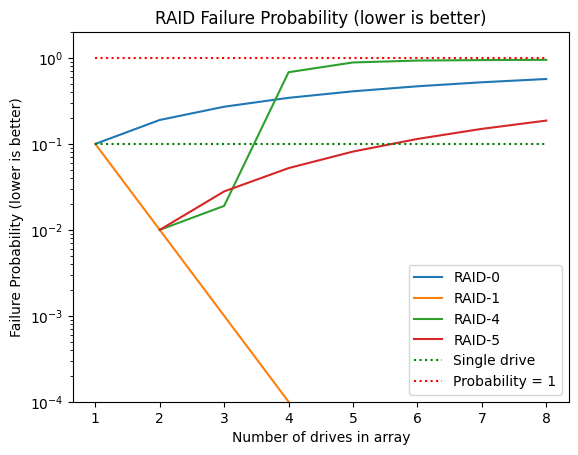
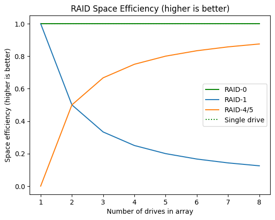
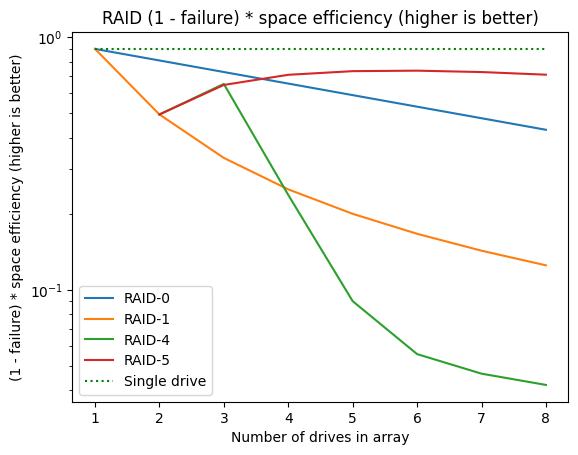

# RAID is a compromise
If you ever needed to use a bunch of disks as a single disk, then you might have heard of RAID. This [wikipedia article](https://en.wikipedia.org/wiki/Standard_RAID_levels) is a good reference for a few commonly used RAID types.

| Name | Usable Disk Size | Redundant Disks | Description | 
| --- | --- | --- | --- | 
| Stripe (RAID-0) |  n | 0 | Spreads data evenly among all disks | 
| Mirror (RAID-1) | 1 | n-1 | Copies the same data into every disk |
| Dedicated Parity (RAID-4) | n-1 | 1 | Uses a single disk as parity | 
| Distributed Parity (RAID-5) | n-1 | 1 | Distributes parity across all disks | 

## RAID can lower the risk of data loss in a system
This is a plot of failure probabilities (vertical axis is log) (here's the [notebook](https://github.com/tianle91/tianle91.github.io/blob/master/blog/2023-07-21_RAID_is_a_compromise/disk_failure.ipynb) that produced the plots):

We can see that Mirror (RAID-1) enjoys a lower failure probability than a single drive for any number of drives in the array. After all, the number of drives in the mirror array *is equivalent to the number of backups*. 

> But maybe you've heard that [RAID is NOT a backup!](https://www.raidisnotabackup.com)? 

Of course, RAID offers zero protection from programs writing the wrong data to disk and also your hardware device just breaking down. As your risk during these scenarios would be the same whether or not you used RAID, we will not be factoring this in the discussion.

You can also find that RAID-4 and RAID-5 enjoy lower failure probability but only up to a certain number of drives. For RAID-4 this is 3 drives whereas it's 5 drives for RAID-5. This is because for RAID-4 ([unraid does this](https://docs.unraid.net/unraid-os/manual/storage-management#parity-disks)), the parity is on only one drive whereas for RAID-5, the parity is on all drives. It is therefore recommended that one uses distributed parity (RAID-5) whenever possible since the number of drives sacrificed is the same. 

## RAID is a compromise
All RAID setups compromise on space efficiency. Adding more drives to RAID-1 only increases the number of backups so the space efficiency only decreases the more drives you add. For RAID-4/5 there's only one parity drive so space efficiency trends closer to 100% as you increase the number of drives in the array. 

Here's a plot:

If you combine failure probabilities and space efficiency to produce a single combined measure, you can find that all RAID types fare worse than a single drive (vertical axis is log).

However, for distributed RAID types (i.e. Striped RAID-0, RAID-4/5), you can enjoy improved read write speeds at the cost of space efficiency. So if that's your usecase then this might be a compromise that works for you.

| Name | Use Case | 
| --- | --- |
| Stripe (RAID-0) | Read/Write Speed |
| Mirror (RAID-1) | Replica/Backup |
| Dedicated Parity (RAID-4) | Worse RAID-5, use only if there are other features you value more | 
| Distributed Parity (RAID-5) | Best compromise of failure rate and space efficiency | 

## Lastly
Remember that RAID is just a compromised version of a single drive when one is considering just failure probability and space efficiency. There are so many other dumb ways to lose your data, so use the [3-2-1 strategy](https://www.backblaze.com/blog/the-3-2-1-backup-strategy/) when protecting your data on your device.
